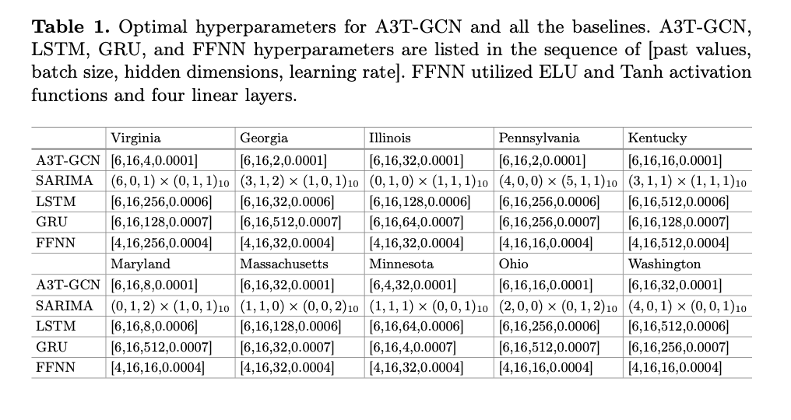
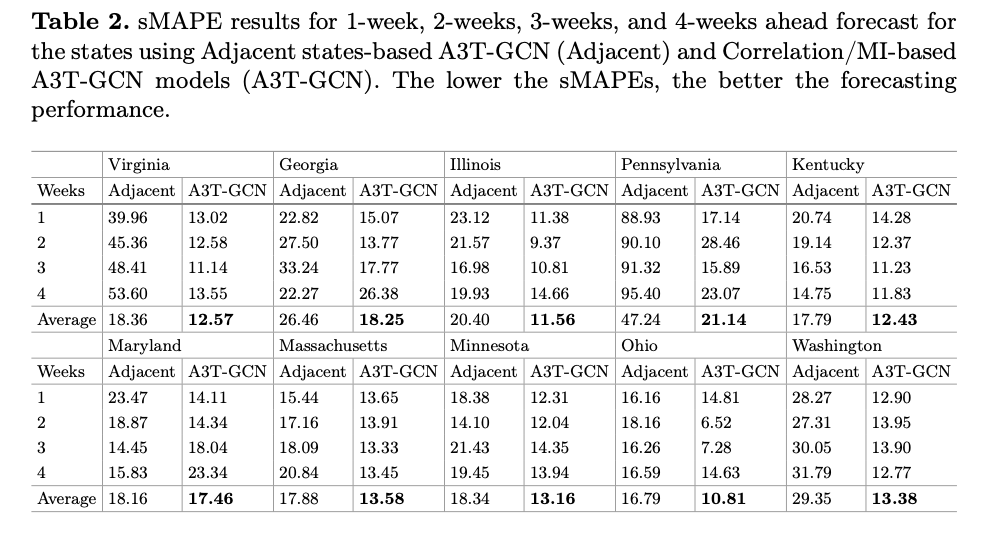
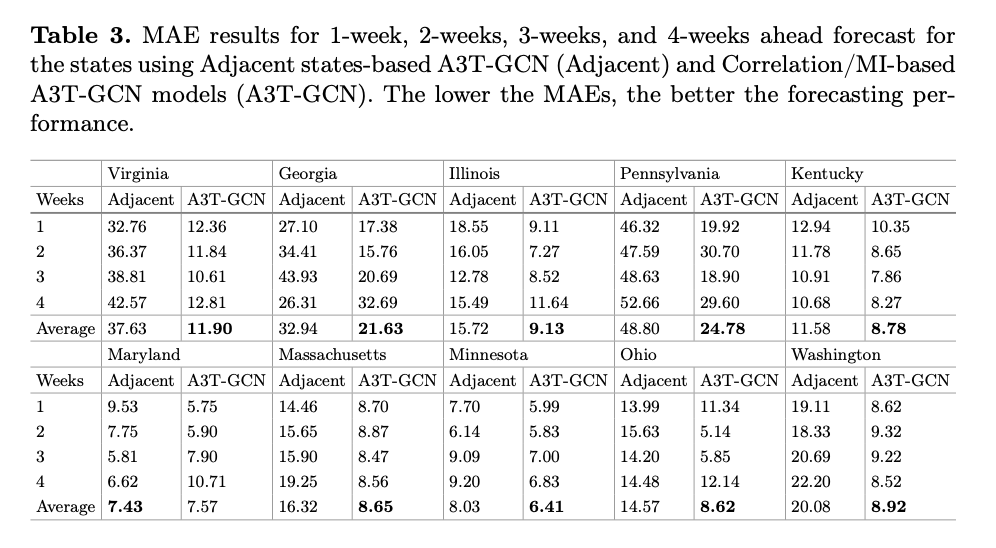
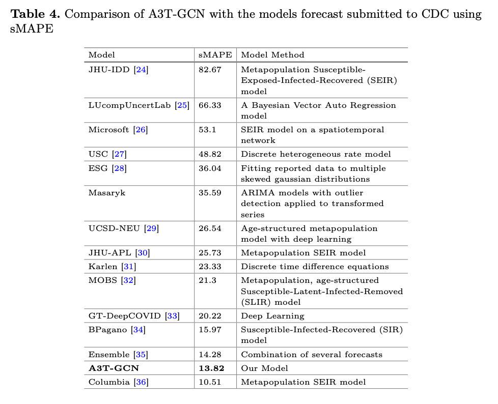

# A3T-GCN: Attention Temporal Graph Convolutional Network

This repository presents our work on COVID-19 case forecasting using the **A3T-GCN**. Our model integrates spatiotemporal dynamics across U.S. states using adaptive graph construction techniques and attention mechanisms.

---

## 🧠 Project Overview

We use the **A3T-GCN** model implemented in **PyGT** for time series forecasting on a U.S. state-level COVID-19 dataset. The model leverages both temporal and spatial dependencies across states by:

- Capturing **temporal dynamics** through attention-augmented GCNs.
- Modeling **spatial dependencies** via graphs constructed using:
  - **Linear correlation**
  - **Mutual information (MI)** for nonlinear dependencies
  - **Geographical adjacency** (shared borders)

By encoding dependencies among highly correlated regions, our model is able to forecast pandemic trends more accurately than traditional baselines.

---

## 📊 Dataset

We use the **State-level Weekly COVID-19 Dataset**:
- 📍 [Download from GitHub](https://github.com/scalation/data/blob/master/COVID-State/2023-05-02-17-53-19-State_Weekly.csv)
- Time span: April 18, 2020 – March 11, 2023
- Format: Weekly frequency, 8819 rows × 19 columns
- Source: [JHU CSSE COVID-19 Data](https://github.com/CSSEGISandData/COVID-19)

### 🧼 Preprocessing:
- Cumulative daily values with negatives were converted to weekly aggregates.
- Negative artifacts (e.g., -60 deaths on May 1, 2020 in Maryland) were resolved via weekly smoothing.
- Only U.S. states were retained; other regions were dropped.
- Features used: `Confirmed`, `Deaths` (others had missing data).
- Standardization: Z-score normalization (mean 0, std 1) before training.

---

## 🧪 Experiments & Training Details

We used a **sliding window forecasting** approach:
- Input window: 114 weeks
- Forecast horizon: 4 weeks
- Sliding step: 1 week
- Split: 80% training, 20% testing
- Split method: `TemporalSignalTrainTestSplit` from PyGT

### ⚙️ Hyperparameters
| Parameter         | Value        |
|------------------|--------------|
| Epochs           | 100          |
| Optimizer        | Adam         |
| Learning Rate    | 1e-4         |
| Loss Function    | Mean Squared Error (MSE) |
| Frameworks Used  | PyTorch, PyGT |

---

## 📈 Evaluation Metrics

We evaluate forecasts using:

### 🔹 Symmetric Mean Absolute Percentage Error (sMAPE)
\[
\text{sMAPE} = \frac{200}{n} \sum_{t=1}^n \frac{|y_t - \hat{y}_t|}{|y_t| + |\hat{y}_t|}
\]
- Bounded between 0% (perfect) and 200% (completely incorrect)
- Useful when dealing with low or zero counts in pandemics

### 🔹 Mean Absolute Error (MAE)
\[
\text{MAE} = \frac{1}{n} \sum_{t=1}^n |y_t - \hat{y}_t|
\]
- Measures average absolute deviation between predictions and actual values
  
---

## Optimized Hyperparameters


---

## Results




---

## 📁 Code

The full implementation and the datasets are available in this repository and repository below.
➡️ [A3T-GCN GitHub Repository](https://www.github.com/Subasranaa/COVID-19-A3T-GCN2)

---

## 📌 CDC Data for Comparison

For comparative evaluation with CDC forecasts, data were sourced from:
- [CDC COVID Data Tracker](https://covid.cdc.gov/COVID-DATA-TRACKER/?submenu-select=national-lab#datatracker-home)

---

## 🧠 Citation

If you use this work in your research, please consider citing the corresponding paper.
```
@inproceedings{rana2023exploring,
  title={Exploring the predictive power of correlation and mutual information in attention temporal graph convolutional network for COVID-19 forecasting},
  author={Rana, Subas and Barna, Nasid Habib and Miller, John A},
  booktitle={International Conference on Big Data},
  pages={18--33},
  year={2023},
  organization={Springer}
}
```
---

## 📬 Contact

For questions or collaboration inquiries, feel free to reach out:

**Subas Rana**  
Ph.D. Candidate 
Graduate Research Assistant
University of Georgia  
📧 subas.rana187@gmail.com
📧 subas.rana@uga.edu

---


