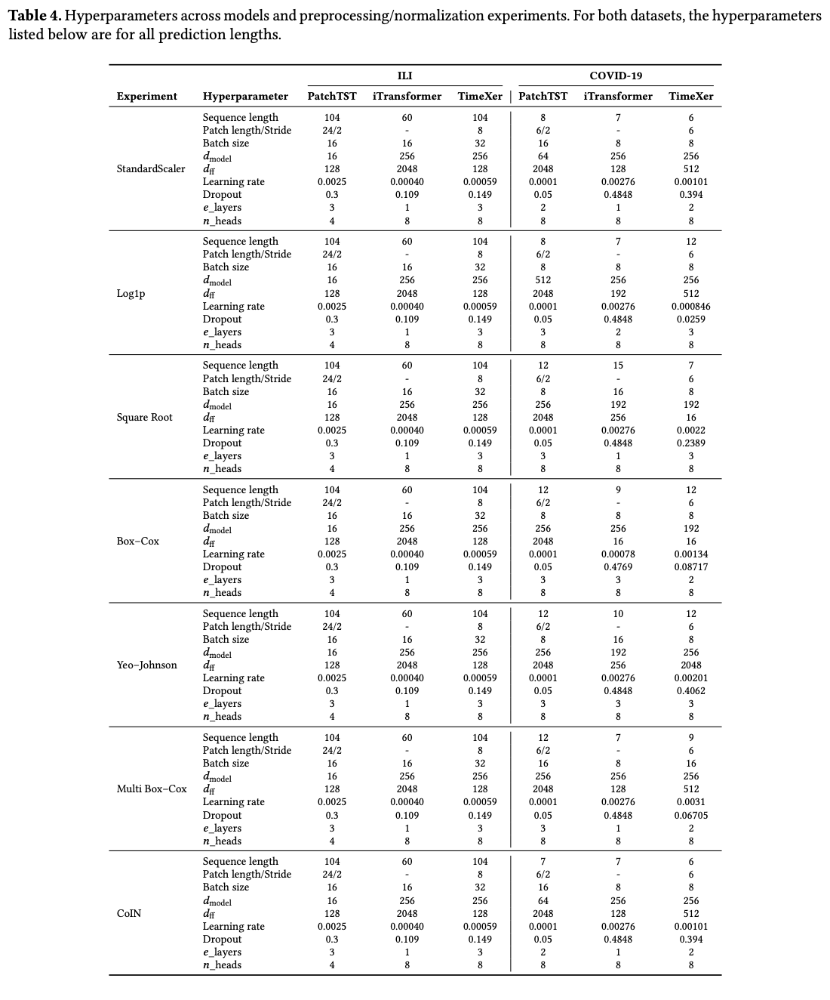

# Normalization in Transformers

This repository contains the implementation and experiments for the paper:  
**“Normalization in Transformers”**  

---

### Contributions
- **Preprocessing Techniques**: effect of different normalization and preprocessing strategies on Transformers. 
- **CoIN**: an instance normalization technique for time series, implemented in [`layers/CoIN.py`](layers/CoIN.py).  
- **Multivariate Box–Cox**: an extension of the classic Box–Cox transformation to the multivariate setting, used as a preprocessing option.  

---

### Repository Structure

- **`PatchTST/`**  
  Codebase from the PatchTST paper, adapted for our experiments.  

- **`TimeXer + iTransformer/`**  
  Codebase from the TimeXer paper, including both **TimeXer** and **iTransformer** implementations used in our experiments.  

- **`layers/CoIN.py`**  
  Implementation of our proposed **CoIN** normalization strategy.  

- **`run_COVID.ipynb`**  
  Notebook to reproduce experiments on the **COVID-19 weekly mortality dataset**.  

- **`run_illness.ipynb`**  
  Notebook to reproduce experiments on the **ILI (Influenza-Like Illness) dataset**.  

---

### Preprocessing Methods

We evaluate the following preprocessing and normalization techniques.  
These can be specified via the `--scale_method` argument in the code or notebooks:  

- `log1p`  
- `sqrt`  
- `box-cox`  
- `yeo-johnson`  
- `standardscaler`  
- `multi-box-cox` (our proposed **multivariate Box–Cox**)

### CoIN Configuration

To use **CoIN**, set the following parameters in your config or training script:

```python
per_h_enable = True
per_h_cutoff = K
blend_tail_steps = H_cutoff
input_blend = True
blend_mode = 'hard'
```
---

## 🔧 Installation

```bash
git clone -b dev_sr https://github.com/scalation/scalation_py.git
cd scalation_py/Normalizations/TimeXer+iTransformer
pip install -r requirements.txt
```

## 🚀 Run Experiments

After installation, you can reproduce our results using the provided notebooks:

- **COVID-19 dataset:** open and run [`run_COVID.ipynb`](run_COVID.ipynb)  
- **ILI dataset:** open and run [`run_illness.ipynb`](run_illness.ipynb)  

You can switch preprocessing methods by setting the `--scale_method` parameter to one of:  [log1p, sqrt, box-cox, yeo-johnson, standardscaler, multi-box-cox]

## Hyperparameters

The hyperparameters used in our experiments are summarized below:




